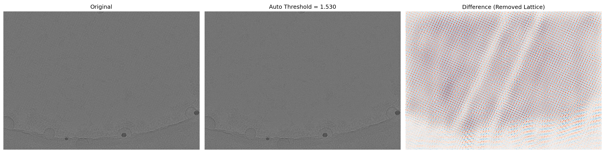

# Lattice Subtraction for Cryo-EM Micrographs

```
.__          __    __  .__                                   ___.    
|  | _____ _/  |__/  |_|__| ____  ____             ________ _\_ |__  
|  | \__  \\   __\   __\  |/ ___\/ __ \   ______  /  ___/  |  \ __ \ 
|  |__/ __ \|  |  |  | |  \  \__\  ___/  /_____/  \___ \|  |  / \_\ \
|____(____  /__|  |__| |__|\___  >___  >         /____  >____/|___  /
          \/                   \/    \/               \/          \/ 
```

[](https://www.python.org/downloads/)
[](https://pytorch.org/)
[](https://developer.nvidia.com/cuda-toolkit)
[](https://opensource.org/licenses/MIT)

A Python package for computationally removing periodic crystal lattice signals (Bragg spots) from cryo-EM micrographs to reveal non-periodic features such as defects, individual particles, or molecular tags.


*Example output: Original micrograph (left), lattice-subtracted result (center), and difference showing removed periodic pattern (right).*

## Overview

When imaging 2D crystal samples in cryo-EM, the periodic lattice produces strong diffraction spots in Fourier space that can obscure weaker signals from non-periodic features. This package implements a **phase-preserving lattice subtraction algorithm** that:

1. Identifies lattice peaks via thresholding on the log-power spectrum
2. Protects low-frequency (structural) and high-frequency (noise) regions
3. **Inpaints** the lattice peak regions with local average amplitudes
4. Preserves the original phase information for accurate reconstruction

## Key Features

- **GPU Acceleration**: PyTorch CUDA backend for high-performance FFT operations
- **CPU/GPU Parity**: Identical numerical results between backends (max diff < 1e-8)
- **10-100× faster** processing via optimized NumPy/SciPy/PyTorch operations
- **Parallel batch processing** for large datasets
- **Configuration files** (YAML) for reproducible experiments
- **Command-line interface** for easy integration into pipelines

## Installation

### From PyPI (Recommended)

```bash
pip install lattice-sub
```

This installs the package with all dependencies including PyTorch with CUDA support.

### GPU Support

**Good news: GPU acceleration usually works automatically!** PyTorch 2.5+ bundles CUDA libraries, so most users don't need any extra setup.

Verify your GPU is detected:

```bash
python -c "import torch; print(f'GPU: {torch.cuda.get_device_name(0)}' if torch.cuda.is_available() else 'CPU only')"
```

If you see your GPU name, you're all set! If not, you can try:

```bash
lattice-sub setup-gpu
```

This command will either confirm your GPU is already working, or help install the correct PyTorch CUDA wheels for older setups.

### From Source (Development)

```bash
# Clone the repository
git clone https://github.com/gsstephenson/cryoem-lattice-subtraction.git
cd cryoem-lattice-subtraction

# Create conda environment with Python 3.11
conda create -n lattice_sub python=3.11 -y
conda activate lattice_sub

# Install the package in development mode
pip install -e .

# Enable GPU (one-time)
lattice-sub setup-gpu
```

### Verify GPU Support

```bash
python -c "import torch; print(f'CUDA available: {torch.cuda.is_available()}'); print(f'GPU: {torch.cuda.get_device_name(0) if torch.cuda.is_available() else \"N/A\"}')"
```

Expected output (example with RTX 3090):
```
CUDA available: True
GPU: NVIDIA GeForce RTX 3090
```

---

## Environment Setup Guide

This section provides a detailed walkthrough for setting up the environment from scratch, based on the actual installation process used during development.

### System Requirements

- **OS**: Linux (tested on Ubuntu 24.04)
- **GPU**: NVIDIA GPU with CUDA 12.4+ support (RTX 30/40 series, A100, etc.)
- **Driver**: NVIDIA driver 550+ (check with `nvidia-smi`)
- **Conda**: Miniconda or Anaconda

### Step-by-Step Installation

#### 1. Create a Minimal Conda Environment

Start with a clean Python 3.11 environment to avoid dependency conflicts:

```bash
# Clean conda cache if you have issues
conda clean --all -y

# Create minimal environment with just Python
conda create -n lattice_sub python=3.11 -y
conda activate lattice_sub
```

#### 2. Install Scientific Python Stack via pip

Using pip is faster than conda for these packages:

```bash
pip install numpy scipy mrcfile pyyaml tqdm click scikit-image matplotlib pytest
```

#### 3. Install PyTorch with CUDA Support

**Important**: Use the PyTorch pip index for reliable CUDA library installation:

```bash
pip install torch torchvision --index-url https://download.pytorch.org/whl/cu124
```

This installs PyTorch 2.6+ with bundled CUDA 12.4 libraries, avoiding system CUDA toolkit issues.

#### 4. Verify CUDA is Working

```bash
python -c "import torch; print(f'PyTorch: {torch.__version__}'); print(f'CUDA available: {torch.cuda.is_available()}'); print(f'GPU: {torch.cuda.get_device_name(0) if torch.cuda.is_available() else \"N/A\"}')"
```

Expected output:
```
PyTorch: 2.6.0+cu124
CUDA available: True
GPU: NVIDIA GeForce RTX 3090
```

#### 5. Install the Package

```bash
cd cryoem-lattice-subtraction
pip install -e .
```

#### 6. Run Tests

```bash
pytest tests/ -v
```

All 12 tests should pass.

### Troubleshooting

| Issue | Solution |
|-------|----------|
| `conda create` hangs | Use `mamba` or install packages via pip instead |
| CUDA not available | Check `nvidia-smi` works, reinstall PyTorch with correct CUDA version |
| Import errors | Ensure you're in the `lattice_sub` conda environment |
| cupy/CuPy errors | This package uses PyTorch, not CuPy - ignore CuPy |

---

## Running GPU Processing on Test Images

### Example: Process a Single Micrograph

```bash
# Activate the environment
conda activate lattice_sub

# Process (GPU used automatically if available)
lattice-sub process /path/to/18Dec27_SP_pos4_0411.mrc \
    -o output_subtracted.mrc \
    --pixel-size 0.56 \
    -v
```

### Example: Python Script for GPU Processing with Visualization

```python
import numpy as np
import matplotlib.pyplot as plt
import mrcfile
from lattice_subtraction import Config, LatticeSubtractor

# Configuration
input_file = "18Dec27_SP_pos4_0411.mrc"
output_file = "subtracted_0411.mrc"

# Load original for comparison
with mrcfile.open(input_file, 'r') as f:
    original = f.data.copy()

# Process with GPU (PyTorch backend)
config = Config(
    pixel_ang=0.56,        # Pixel size in Angstroms
    threshold=1.42,        # Peak detection threshold
    inside_radius_ang=90,  # Protect low-resolution features
    backend="pytorch"      # Use GPU acceleration
)

subtractor = LatticeSubtractor(config)
result = subtractor.process(input_file)
result.save(output_file, pixel_size=0.56)

# Visualize results
processed = result.image
difference = original - processed

fig, axes = plt.subplots(1, 3, figsize=(18, 6))
vmin, vmax = np.percentile(original, [1, 99])

axes[0].imshow(original, cmap='gray', vmin=vmin, vmax=vmax)
axes[0].set_title(f'Original\n{original.shape}')
axes[0].axis('off')

axes[1].imshow(processed, cmap='gray', vmin=vmin, vmax=vmax)
axes[1].set_title(f'Lattice Subtracted\n{processed.shape}')
axes[1].axis('off')

axes[2].imshow(difference, cmap='RdBu_r', 
               vmin=-np.std(difference)*3, vmax=np.std(difference)*3)
axes[2].set_title('Difference (Removed Lattice)')
axes[2].axis('off')

plt.suptitle('Lattice Subtraction Result', fontsize=14)
plt.tight_layout()
plt.savefig('comparison.png', dpi=150)
plt.show()
```

### Verify CPU and GPU Produce Identical Results

```python
import numpy as np
from lattice_subtraction import Config, LatticeSubtractor

input_file = "18Dec27_SP_pos4_0411.mrc"

# CPU (numpy backend)
cfg_cpu = Config(pixel_ang=0.56, threshold=1.42, backend='numpy')
result_cpu = LatticeSubtractor(cfg_cpu).process(input_file)

# GPU (pytorch backend)
cfg_gpu = Config(pixel_ang=0.56, threshold=1.42, backend='pytorch')
result_gpu = LatticeSubtractor(cfg_gpu).process(input_file)

# Compare
diff = np.abs(result_cpu.image - result_gpu.image)
print(f'Max difference: {diff.max():.2e}')
print(f'Identical: {np.allclose(result_cpu.image, result_gpu.image, atol=1e-5)}')
```

Expected output:
```
Max difference: 1.49e-08
Identical: True
```

---

## Quick Start

### Python API

```python
from lattice_subtraction import LatticeSubtractor, Config

# Create configuration
config = Config(
    pixel_ang=0.56,       # Pixel size in Angstroms
    threshold=1.42,       # Peak detection threshold
    inside_radius_ang=90, # Protect low-frequency region
    backend="pytorch"     # Use GPU acceleration
)

# Process a micrograph
subtractor = LatticeSubtractor(config)
result = subtractor.process("input.mrc")
result.save("output.mrc")
```

### Command Line

```bash
# Process a single file (GPU used automatically if available)
lattice-sub process input.mrc -o output.mrc --pixel-size 0.56

# Force CPU processing
lattice-sub process input.mrc -o output.mrc --pixel-size 0.56 --cpu

# Batch process a directory (GPU - single worker is optimal)
lattice-sub batch input_dir/ output_dir/ --pixel-size 0.56

# Batch process with automatic visualization generation
lattice-sub batch input_dir/ output_dir/ --pixel-size 0.56 --vis viz_dir/

# CPU batch with parallel workers (only useful with --cpu flag)
lattice-sub batch input_dir/ output_dir/ --pixel-size 0.56 --cpu -j 8

# Generate visualizations for existing processed files
lattice-sub visualize input_dir/ output_dir/ viz_dir/

# Create a configuration file
lattice-sub init-config params.yaml --pixel-size 0.56
```

### Using Configuration Files

```yaml
# params.yaml
pixel_ang: 0.56
threshold: 1.42
inside_radius_ang: 90
outside_radius_ang: null  # Auto-calculated
expand_pixel: 10
unit_cell_ang: 116  # Nucleosome repeat distance
backend: auto       # "auto" (default), "numpy" for CPU, "pytorch" for GPU
```

```bash
lattice-sub process input.mrc -o output.mrc --config params.yaml
```

### Terminal Interface

When running interactively, `lattice-sub` displays a styled terminal interface with progress information:

```
.__          __    __  .__                                   ___.    
|  | _____ _/  |__/  |_|__| ____  ____             ________ _\_ |__  
|  | \__  \\   __\   __\  |/ ___\/ __ \   ______  /  ___/  |  \ __ \ 
|  |__/ __ \|  |  |  | |  \  \__\  ___/  /_____/  \___ \|  |  / \_\ \
|____(____  /__|  |__| |__|\___  >___  >         /____  >____/|___  /
          \/                   \/    \/               \/          \/ 

  Phase-preserving FFT inpainting for cryo-EM  |  v1.0.0

  Configuration
  -------------
    Pixel size:  0.56 A
    Threshold:   1.42
    Backend:     PyTorch CUDA (NVIDIA GeForce RTX 3090)

  > Processing: 18Dec27_SP_pos4_0411.mrc
    |- Size: 4092 x 5760
    `- [OK] Complete (3.45s)
```

**Pipeline mode**: When output is piped (e.g., `lattice-sub process ... | grep`), decorative output is automatically suppressed.

**Quiet mode**: Use `--quiet` or `-q` to suppress decorative output even in interactive mode:

```bash
lattice-sub process input.mrc -o output.mrc -p 0.56 --quiet
```

## Algorithm Details

### Processing Pipeline

```
Input Image → Pad → FFT → Detect Peaks → Create Mask → Inpaint → iFFT → Crop → Output
```

1. **Padding**: Image is padded with mean value to reduce edge artifacts
2. **FFT**: 2D Fast Fourier Transform brings image to frequency domain
3. **Peak Detection**: Log-power spectrum is background-subtracted and thresholded
4. **Mask Creation**: Combines peak mask with radial limits:
   - **Inner radius** (default 90Å): Protects low-frequency structural information
   - **Outer radius** (near Nyquist): Protects high-frequency details
5. **Inpainting**: Lattice peaks are replaced with local average amplitude from 4 neighboring pixels (shifted by ~half unit cell distance)
6. **Phase Preservation**: Original phase is retained; only amplitude is modified
7. **Inverse FFT**: Returns to real space with lattice removed

### Key Parameters

| Parameter | Default | Description |
|-----------|---------|-------------|
| `pixel_ang` | *required* | Pixel size in Ångstroms |
| `threshold` | 1.42 | Peak detection threshold on log-amplitude |
| `inside_radius_ang` | 90 | Resolution limit for center protection (Å) |
| `outside_radius_ang` | auto | Resolution limit for edge protection (Å) |
| `expand_pixel` | 10 | Morphological expansion of peak mask |
| `unit_cell_ang` | 116 | Crystal unit cell for shift calculation (Å) |
| `backend` | auto | Computation backend: "auto", "numpy" (CPU) or "pytorch" (GPU) |

## GPU Acceleration

GPU is used automatically when available. After running `lattice-sub setup-gpu`, the tool will detect and use your GPU:

```python
config = Config(pixel_ang=0.56)  # backend="auto" by default
subtractor = LatticeSubtractor(config)
# Output: ✓ Using GPU: NVIDIA GeForce RTX 3090
```

Or force CPU via command line:

```bash
lattice-sub process input.mrc -o output.mrc --pixel-size 0.56 --cpu
```

### Supported Hardware

- **NVIDIA GPUs** with CUDA 12.4 support (Ampere, Ada Lovelace, Hopper architectures)
- Tested on: RTX 3090, RTX 4090, A100
- Requires NVIDIA driver 550+ for CUDA 12.4 compatibility

## Batch Processing

### Python API

```python
from lattice_subtraction import BatchProcessor, Config

config = Config(pixel_ang=0.56, backend="pytorch")
processor = BatchProcessor(config, num_workers=8)

# Process all MRC files in a directory
result = processor.process_directory(
    input_dir="raw_micrographs/",
    output_dir="subtracted/",
    pattern="*.mrc"
)

print(f"Processed {result.successful}/{result.total} files")
```

### Command Line with Visualizations

```bash
# Process batch and generate comparison visualizations
lattice-sub batch input_dir/ output_dir/ \
    --pixel-size 0.56 \
    --config gpu_config.yaml \
    --vis visualizations/ \
    -v
```

This creates side-by-side PNG images showing:
- Original micrograph
- Lattice-subtracted result
- Difference image (removed lattice pattern)

### Numbered Sequences

```python
# Process numbered file sequence (like legacy HYPER_loop scripts)
result = processor.process_numbered_sequence(
    input_pattern="data/mic_{num}.mrc",
    output_dir="processed/",
    start=1,
    end=1000,
    zero_pad=4  # mic_0001.mrc, mic_0002.mrc, ...
)
```

---

## Visualization

Generate comparison visualizations to inspect lattice subtraction results.

### Command Line

```bash
# Generate visualizations for existing processed files
lattice-sub visualize input_dir/ output_dir/ viz_dir/

# With custom options
lattice-sub visualize input_dir/ output_dir/ viz_dir/ \
    --prefix sub_ \
    --dpi 200 \
    -v
```

### Python API

```python
from lattice_subtraction import generate_visualizations
from pathlib import Path

# Generate comparison PNGs for all processed images
successful, total = generate_visualizations(
    input_dir=Path("raw_micrographs/"),
    output_dir=Path("subtracted/"),
    viz_dir=Path("visualizations/"),
    prefix="sub_",
    dpi=150,
    show_progress=True,
)
print(f"Created {successful}/{total} visualizations")
```

### Output Format

Each visualization shows three panels:
1. **Original** - Input micrograph with lattice pattern
2. **Lattice Subtracted** - Processed result with lattice removed
3. **Difference** - Red/blue colormap showing the removed periodic pattern

---

## Modernization from Legacy MATLAB Code

This package is a complete rewrite of legacy MATLAB cryo-EM lattice subtraction code, modernized for performance, usability, and maintainability.

### Original MATLAB Codebase

The original code consisted of several MATLAB scripts and functions:

| MATLAB File | Purpose |
|-------------|---------|
| `LAsub.m` / `LAsub_K3.m` | Main entry points for lattice subtraction |
| `bg_push_by_rot.m` | Core algorithm: FFT, peak detection, inpainting |
| `bg_FastSubtract_standard.m` | Background subtraction via morphological opening |
| `bg_drill_hole.m` | Circular mask generation |
| `bg_Pick_Amp_masked_standard.m` | Amplitude-based peak picking |
| `ReadMRC.m` / `WriteMRC.m` | MRC file I/O |
| `HYPER_loop_*.com` | Batch processing shell scripts |
| `PARAMETER` | Configuration file |

### Modernization Improvements

| Aspect | Legacy MATLAB | Modern Python |
|--------|---------------|---------------|
| **Language** | MATLAB (proprietary) | Python 3.11 (open source) |
| **GPU Support** | None | PyTorch CUDA 12.4 |
| **Parallelization** | Shell scripts | Native multiprocessing |
| **Configuration** | Hardcoded values | YAML config files |
| **CLI** | None | Click-based CLI |
| **Testing** | None | pytest with 12 unit tests |
| **Packaging** | Scripts | pip-installable package |
| **Documentation** | Comments only | Full README + docstrings |

### Algorithm Preservation

The core FFT-based inpainting algorithm was carefully preserved:

```
MATLAB: y2 = fft2(img); y2 = fftshift(y2);
Python: fft_shifted = torch.fft.fftshift(torch.fft.fft2(img))

MATLAB: y2_A = mask_final .* y2;
Python: fft_keep = mask_final_dev * fft_shifted

MATLAB: shifted = circshift(abs_y2_A, [shift_pixel, 0]) + ...
Python: shift_avg = torch.roll(amplitude_keep, shift_pixels, dims=0) + ...

MATLAB: y2 = y2_A + value_y2_B .* exp(i .* angle_y2_ori_B);
Python: fft_result = fft_keep + inpaint_amplitude * torch.exp(1j * original_phase)
```

### API Correspondence

| MATLAB (Legacy) | Python (New) |
|-----------------|--------------|
| `LAsub('input.mrc')` | `subtractor.process("input.mrc")` |
| `bg_push_by_rot(img, thresh, ...)` | `LatticeSubtractor._process_padded(image)` |
| `bg_FastSubtract_standard(pw)` | `processing.subtract_background(pw)` |
| `bg_drill_hole(box, r)` | `masks.create_circular_mask(shape, r)` |
| `ReadMRC(file)` | `io.read_mrc(file)` |
| `WriteMRC(data, 1, file)` | `io.write_mrc(data, file)` |

### Migration Guide

```bash
# Convert legacy PARAMETER file to YAML (if available)
# Example manual conversion:
cat << 'EOF' > params.yaml
pixel_ang: 0.56
threshold: 1.42
inside_radius_ang: 90
expand_pixel: 10
unit_cell_ang: 116
backend: auto
EOF

# Process with new tool (GPU auto-detected)
lattice-sub process input.mrc -o output.mrc --config params.yaml
```

---

## Development

### Running Tests

```bash
pytest tests/ -v
```

### Code Structure

```
src/lattice_subtraction/
├── __init__.py        # Package exports
├── config.py          # Configuration dataclass
├── core.py            # LatticeSubtractor main class
├── batch.py           # Parallel batch processing
├── cli.py             # Command-line interface
├── io.py              # MRC file I/O
├── masks.py           # Circular mask utilities
├── processing.py      # FFT helpers, background subtraction
├── ui.py              # Terminal UI with ASCII banner
└── visualization.py   # Comparison figure generation
```

## Citation

If you use this software in your research, please cite:

```bibtex
@software{lattice_subtraction,
  title = {Lattice Subtraction for Cryo-EM Micrographs},
  author = {Stephenson, G. and Kasinath Lab},
  year = {2026},
  url = {https://github.com/gsstephenson/cryoem-lattice-subtraction}
}
```

## License

MIT License - see [LICENSE](LICENSE) for details.

## Acknowledgments

This package is a modernization of MATLAB code originally developed for nucleosome array imaging. The phase-preserving inpainting algorithm was designed to reveal protein complexes bound to 2D crystal surfaces.

**Original MATLAB code**: Kasinath Lab legacy codebase  
**Python port and GPU acceleration**: George Stephenson, 2026