# Lattice Subtraction Architecture

## Processing Pipeline

```mermaid
flowchart TB
    subgraph Input["📁 Input"]
        MRC[("MRC File<br/>Cryo-EM Micrograph")]
        CONFIG["⚙️ Config<br/>pixel_size, threshold, radii"]
    end

    subgraph Core["🔬 Core Processing (LatticeSubtractor)"]
        direction TB
        PAD["1️⃣ Pad Image<br/>Mean-value padding"]
        FFT["2️⃣ 2D FFT<br/>→ Frequency Domain"]
        
        subgraph Detection["Peak Detection"]
            LOG["Log Power Spectrum"]
            BG["Background Subtraction"]
            THRESH["Threshold Detection"]
        end
        
        subgraph Masking["Mask Creation"]
            PEAKS["Peak Mask"]
            RADIAL["Radial Limits<br/>inner: 90Å, outer: Nyquist"]
            EXPAND["Morphological Expansion"]
        end
        
        subgraph Inpaint["Phase-Preserving Inpainting"]
            SHIFT["Shift by ½ unit cell"]
            AVG["Average 4 neighbors"]
            PHASE["Preserve original phase"]
        end
        
        IFFT["3️⃣ Inverse FFT<br/>→ Real Space"]
        CROP["4️⃣ Crop to Original Size"]
    end

    subgraph Backend["⚡ Compute Backend"]
        CPU["NumPy/SciPy<br/>CPU"]
        GPU["PyTorch CUDA<br/>GPU"]
    end

    subgraph Output["📤 Output"]
        OUT_MRC[("Subtracted MRC<br/>Lattice Removed")]
        VIZ["🖼️ Visualization<br/>3-panel PNG"]
    end

    MRC --> PAD
    CONFIG --> Core
    PAD --> FFT
    FFT --> LOG
    LOG --> BG --> THRESH
    THRESH --> PEAKS
    PEAKS --> RADIAL --> EXPAND
    EXPAND --> SHIFT
    SHIFT --> AVG --> PHASE
    PHASE --> IFFT
    IFFT --> CROP
    CROP --> OUT_MRC
    OUT_MRC --> VIZ

    Backend -.-> Core
    CPU -.-> |"numpy backend"| FFT
    GPU -.-> |"pytorch backend"| FFT
```

## Batch Processing Architecture

```mermaid
flowchart LR
    subgraph Input["📂 Input Directory"]
        F1["mic_001.mrc"]
        F2["mic_002.mrc"]
        F3["mic_003.mrc"]
        FN["...mic_N.mrc"]
    end

    subgraph Batch["🔄 BatchProcessor"]
        direction TB
        SCAN["Scan Directory<br/>glob pattern"]
        
        subgraph Mode["Processing Mode"]
            SEQ["Sequential<br/>(GPU)"]
            PAR["Parallel<br/>(CPU, N workers)"]
        end
        
        PROG["📊 Progress Bar<br/>tqdm"]
    end

    subgraph Process["🔬 LatticeSubtractor"]
        CORE["Core Algorithm"]
    end

    subgraph Output["📂 Output"]
        O1["sub_mic_001.mrc"]
        O2["sub_mic_002.mrc"]
        O3["sub_mic_003.mrc"]
        ON["...sub_mic_N.mrc"]
        
        subgraph Viz["📊 Visualizations"]
            V1["mic_001_comparison.png"]
            VN["..."]
        end
    end

    F1 & F2 & F3 & FN --> SCAN
    SCAN --> Mode
    SEQ --> CORE
    PAR --> CORE
    CORE --> O1 & O2 & O3 & ON
    O1 & O2 & O3 & ON --> Viz
    Mode --> PROG
```

## CLI Command Structure

```mermaid
flowchart TB
    subgraph CLI["🖥️ lattice-sub CLI"]
        MAIN["lattice-sub"]
        
        MAIN --> PROCESS["process<br/>Single file"]
        MAIN --> BATCH["batch<br/>Directory"]
        MAIN --> VIZ["visualize<br/>Generate PNGs"]
        
        subgraph Options["Common Options"]
            PIXEL["-p, --pixel-size"]
            THRESH["-t, --threshold"]
            GPU["--gpu"]
            QUIET["-q, --quiet"]
            VERBOSE["-v, --verbose"]
        end
        
        PROCESS --> Options
        BATCH --> Options
        BATCH --> VIS_OPT["--vis<br/>Auto-visualize"]
        BATCH --> WORKERS["-j, --workers"]
    end

    subgraph UI["🎨 Terminal UI"]
        BANNER["ASCII Banner"]
        COLORS["Colored Output"]
        PROGRESS["Progress Bars"]
        TTY{"Interactive?"}
        
        TTY -->|Yes| BANNER
        TTY -->|No/Quiet| PLAIN["Plain Output"]
    end

    CLI --> UI
```

## Module Dependencies

## Data Flow: Single Image Processing

---

## Rendering These Diagrams

These Mermaid diagrams can be rendered in:

1. **GitHub** - Automatically renders in README and markdown files
2. **VS Code** - Install "Markdown Preview Mermaid Support" extension
3. **Online** - Use [Mermaid Live Editor](https://mermaid.live)
4. **Documentation** - Works with MkDocs, Sphinx, Docusaurus

To view in VS Code, open this file and use `Ctrl+Shift+V` (or `Cmd+Shift+V` on Mac) to preview.
